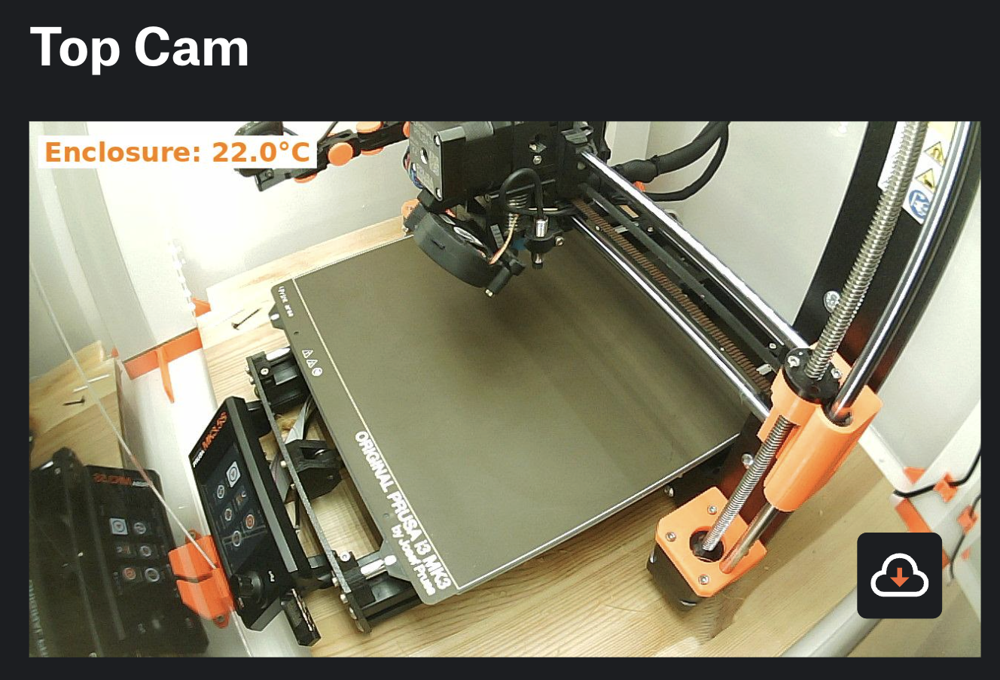

# PrusaConnectUploader
Uploads Snapshots to Prusa Connect and supports Enclosure Temp. 
This is a solution for everyone who switched from OctoPrint to Prusa Connect.
With the MK3.5 Upgrade I started to use Prusa Connect but I couldn't show my Enclosure Temp any more and I needed to upload Snapshots from my two Webcams to PrusaConnect somehow so this is what I came up with. I also use it now for uploading pic to prusa connect for my core one. So I use one rapsi two printers and three cams. Two for the MK3.5 and one for the Core one. 

**Now supports multiple printers on a single Raspberry Pi!**



## Disclaimer
This Docu is mainly made for my future self. But please feel free to add and improve!

## How it works
Basically I use fswebcam to get snapshots from my usb cams and since there is sadly no Enclosure Temp Endpoint in Prusa Connect I simply add and Overlay in the Snapshots. Furthermore I added a "Flashlight" function to it. The Script turns on the LED lights before it takes the snapshots and than turns it off again. There is also a Button connected to the Pi which can overwrite this so it stays on.

### Multiple Printer Support
You can now configure multiple printers on a single Raspberry Pi. Each printer can have:
- Multiple cameras with individual settings
- Optional LED control (can be enabled/disabled per printer)
- Individual GPIO pins for LED and button control
- Prusa Link integration to check if printer is online before uploading

The script only uploads camera snapshots when the printer is detected as online via the Prusa Link API.

## Dependencies
* fswebcam
* python3-requests
* python3-rpi.gpio
* python3-pil

```bash
sudo apt install python3-requests python3-rpi.gpio python3-pil fswebcam
```

or pip

```bash
pip3 install requests RPi.GPIO Pillow
```

## Systemd
I added a simple systemd service to start and stop the service
Just add the prusa-uploader.service. file to your systemd config.

```bash
sudo cp prusa-uploader.service /etc/systemd/system/prusa-uploader.service
sudo systemctl daemon-reload

sudo systemctl enable prusa-uploader.service
sudo systemctl start/stop prusa-uploader.service
```

## Get Camera Ids
```bash
ls /dev/v4l/by-id/
```

## Test Cam
```bash
fswebcam -d /dev/v4l/by-id/usb-Logitech_Webcam_C270_ABC123-video-index0 image.jpg
```

## Configuration
Copy `config.example.json` to `config.json` and edit with your settings:
```bash
cp config.example.json config.json
```

Edit the configuration file with your printer and camera details.

### Top-Level Parameters
| parameter | description |
| --------- | ---------- |
| interval_seconds | Time in seconds between camera uploads |
| printers | Array of printer configurations |

### Printer Parameters
| parameter | description |
| --------- | ---------- |
| name | Printer name (for logging) |
| prusa_link_ip | IP address or hostname of the printer |
| prusa_link_user | Prusa Link username (usually "maker") |
| prusa_link_password | Prusa Link password |
| led_control_enabled | Enable/disable LED flashlight control (true/false) |
| led_pin | GPIO pin number for LED control (can be null if disabled) |
| button_pin | GPIO pin number for button (can be null if disabled) |
| cameras | Array of camera configurations for this printer |

### Camera Parameters
| parameter | description |
| --------- | ---------- |
| name | Display Name for Prusa Connect |
| fingerprint | Just some random min 16byte long string |
| token | Token from Prusa Connect |
| path | Camera ID for fswebcam (use `ls /dev/v4l/by-id/`) |
| width | Camera resolution width |
| height | Camera resolution height |
| overlay_temp | Enable/disable temperature overlay (true/false) |

### Example Configuration
```json
{
    "interval_seconds": 20,
    "printers": [
        {
            "name": "MK3S Printer",
            "prusa_link_ip": "192.168.1.100",
            "prusa_link_user": "maker",
            "prusa_link_password": "your_password",
            "led_control_enabled": true,
            "led_pin": 26,
            "button_pin": 2,
            "cameras": [
                {
                    "name": "Top Camera",
                    "fingerprint": "Top_Cam_MK3S",
                    "token": "your-prusa-connect-token",
                    "path": "/dev/v4l/by-id/usb-Camera-video-index0",
                    "width": 1280,
                    "height": 720,
                    "overlay_temp": true
                }
            ]
        },
        {
            "name": "Core =ne Printer",
            "prusa_link_ip": "192.168.1.101",
            "prusa_link_user": "maker",
            "prusa_link_password": "your_password",
            "led_control_enabled": false,
            "led_pin": null,
            "button_pin": null,
            "cameras": [
                {
                    "name": "Core One Camera",
                    "fingerprint": "Core One Camera",
                    "token": "your-prusa-connect-token",
                    "path": "/dev/v4l/by-id/usb-Camera2-video-index0",
                    "width": 1920,
                    "height": 1080,
                    "overlay_temp": false
                }
            ]
        }
    ]
}
```

## Prusa Connect
Simply add a new "Other Cam" and copy the Token to your config.

## Circuit Schematic

### LED/Flashlight Control (GPIO 26 with MOSFET)

```
                           +12V (or appropriate voltage for LED)
                            |
                            |
                     [LED/Flashlight]
                            |
                            |
                            D (Drain)
GPIO 26 ----[1kΩ]---------- G (MOSFET - N-Channel)
                     |      S (Source)
                     |      |
                  [10kΩ]    |
                (pull-down) |
                     |      |
                    GND    GND
```

### Momentary Switch/Button (GPIO 2 with Pull-Up)

```
                    +3.3V
                     |
                  [10kΩ]
                 (pull-up)
                     |
    GPIO 2 ----------+
                     |
                    [S] Momentary Switch
                     |
                    GND
```

### Component Notes
- **MOSFET**: Use N-Channel like 2N7000 or IRLZ44N (depending on LED current)
- **Gate Resistor (1kΩ)**: Limits current from GPIO to MOSFET gate
- **Pull-down Resistor (10kΩ)**: Ensures MOSFET is OFF when GPIO is not driven
- **Pull-up Resistor (10kΩ)**: Keeps GPIO 2 HIGH when button not pressed
- **Momentary Switch**: Normally open, connects to GND when pressed
- **LED**: Add appropriate current-limiting resistor in series with LED

### Raspberry Pi Pins
- GPIO 26 (Physical Pin 37)
- GPIO 2 (Physical Pin 3)
- GND (Physical Pin 6, 9, 14, 20, 25, 30, 34, or 39)
- 3.3V (Physical Pin 1 or 17)

### Operation
1. GPIO 26 HIGH → MOSFET ON → LED lights up
2. Button press → GPIO 2 pulled LOW (falling edge) → Toggle override mode

